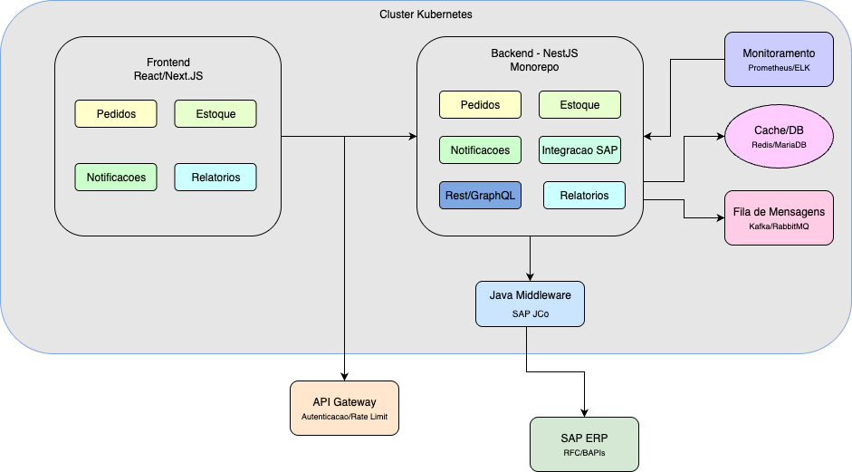

# Sistema de Apoio a Concessionárias Renault

Este repositório contém o projeto de um sistema de apoio a concessionárias, com foco em **consultas de estoque**, **gestão de pedidos**, **notificações** e **análises gerenciais**. A arquitetura foi desenhada para garantir escalabilidade, integração com sistemas legados (SAP), segurança e facilidade de manutenção.

---

## Visão Geral da Arquitetura

A solução é composta por múltiplas camadas, cada uma responsável por uma parte do fluxo de dados e regras de negócio:

- **Frontend (Web/Mobile):** React/Next.js e Flutter
- **API Gateway:** Autenticação, autorização e rate limiting
- **Backend (NestJS Monorepo):** Módulos de negócio (Estoque, Pedidos, Notificações, Relatórios, Integração SAP)
- **Middleware Java:** Integração com SAP via SAP JCo
- **Infraestrutura:** Banco de dados (MariaDB), cache (Redis), mensageria (Kafka/RabbitMQ), monitoramento (Prometheus/ELK), orquestração (Kubernetes)

---



---

## Camadas do Sistema

### 1. Frontend

- **Tecnologias:** React/Next.js (Web), Flutter (Mobile)
- **Responsabilidades:** Interface do usuário, autenticação, consumo das APIs REST/GraphQL expostas pelo backend.
- **Fluxo:** Usuário → Frontend → API Gateway

### 2. API Gateway

- **Funções:** 
  - Validação de autenticação (JWT/OAuth2)
  - Rate limiting
  - Roteamento para os módulos do backend
- **Benefícios:** Centraliza segurança e políticas de acesso.

### 3. Backend (NestJS Monorepo)

- **Organização:** Monorepo com múltiplos módulos:
  - **Estoque:** Consulta e atualização de veículos e peças
  - **Pedidos:** Abertura, acompanhamento e gestão de pedidos de compra/venda
  - **Notificações:** Envio e gerenciamento de notificações para usuários
  - **Relatórios:** Geração de análises gerenciais e dashboards
  - **Integração SAP:** Comunicação com sistemas legados via middleware
- **Comunicação:** REST/GraphQL
- **Autenticação:** JWT/OAuth2, permissões por módulo

### 4. Middleware Java (SAP JCo)

- **Função:** Adaptador para integração entre backend e SAP ERP
- **Tecnologia:** Java + SAP JCo (Java Connector)
- **Fluxo:** Recebe requisições do backend, traduz para RFC/BAPI e comunica com SAP

### 5. SAP ERP

- **Responsável por:** Processos legados de estoque, pedidos, relatórios e integrações corporativas

### 6. Infraestrutura de Suporte

- **Banco de Dados:** MariaDB (relacional), Redis (cache)
- **Mensageria:** Kafka ou RabbitMQ para eventos assíncronos
- **Monitoramento:** Prometheus e ELK Stack para logs e métricas
- **Orquestração:** Kubernetes para deploy e escalabilidade

---

## Fluxo de Comunicação

1. **Usuário** acessa o sistema via Web/Mobile.
2. **Frontend** envia requisições autenticadas para o **API Gateway**.
3. **API Gateway** valida o token e encaminha para o módulo correspondente do **Backend**.
4. **Backend** processa a lógica de negócio, acessa **DB/Cache** ou publica eventos em **Kafka/RabbitMQ**.
5. Para integrações com SAP, o **Backend** chama o **Middleware Java**, que se comunica com o **SAP ERP**.
6. Logs e métricas são enviados para o sistema de **Monitoramento**.

---

## Exemplos de Endpoints

| Módulo         | Endpoint REST/GraphQL                | Descrição                                      | Autenticação |
|----------------|--------------------------------------|------------------------------------------------|--------------|
| Estoque        | `GET /api/estoque`                   | Listar itens de estoque                        | JWT          |
|                | `GET /api/estoque/:id`               | Detalhar item de estoque                       | JWT          |
| Pedidos        | `POST /api/pedidos`                  | Criar novo pedido                              | JWT          |
|                | `GET /api/pedidos/:id`               | Consultar status do pedido                     | JWT          |
| Notificações   | `GET /api/notificacoes`              | Listar notificações do usuário                 | JWT          |
| Relatórios     | `GET /api/relatorios/vendas`         | Relatório de vendas                            | JWT + Permissão |
| Integração SAP | `POST /api/sap/consulta-estoque`     | Consulta estoque em tempo real no SAP          | JWT + Permissão |
|                | `POST /api/sap/criar-pedido`         | Criação de pedido diretamente no SAP           | JWT + Permissão |

---

## Segurança e Autenticação

- **Autenticação:** JWT/OAuth2, tokens enviados no header Authorization.
- **Autorização:** Permissões por módulo e operação, validadas no API Gateway e backend.
- **Rate Limiting:** Proteção contra abuso de APIs no API Gateway.

---

## Integração com SAP

- **Backend** chama endpoints do **Middleware Java** para operações que exigem integração com SAP.
- **Middleware** traduz requisições REST/gRPC para RFC/BAPI, comunicando-se com o **SAP ERP**.
- **Respostas** do SAP são retornadas ao backend e, por fim, ao usuário.

---

## Monitoramento e Observabilidade

- **Logs** e **métricas** de todas as camadas são enviados para Prometheus e ELK Stack.
- **Alertas** configurados para falhas, lentidão ou indisponibilidade.

---

## Orquestração e Deploy

- **Cluster Kubernetes** gerencia deploy, escalabilidade e alta disponibilidade dos serviços.
- **Pipelines CI/CD** automatizam testes, build e deploy.

---

## Diagrama Resumido
```
Usuário (Web/Mobile)
        │
        ▼
Frontend (React/Flutter)
        │
        ▼
API Gateway (Auth, Rate Limit)
        │
        ▼
Backend (NestJS Monorepo)
 ├─ Estoque
 ├─ Pedidos
 ├─ Notificações
 ├─ Relatórios
 └─ Integração SAP
        │
        ├─ Banco de Dados (MariaDB/Redis)
        ├─ Fila de Mensagens (Kafka/RabbitMQ)
        ├─ Monitoramento (Prometheus/ELK)
        └─ Middleware Java (SAP JCo)
                │
                ▼
            SAP ERP
```
